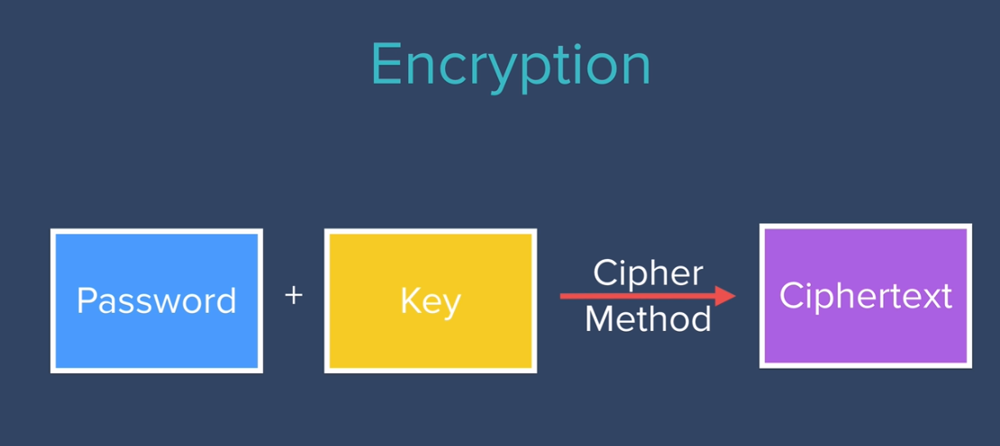
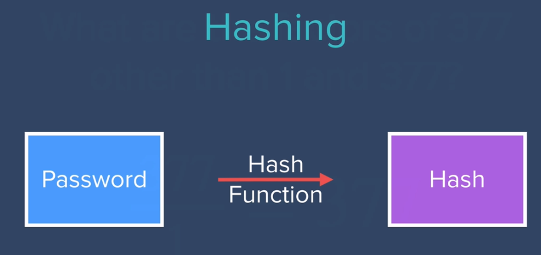

# Authentication & Security

> Check branches to get code for certian level

## Level 1 ( Register Users )

- simply let user register with username and password.
- stored username and password in database without any encryption ( vulnerable ).

## level 2 ( Data Encryption )

> Why Encryption? Any one who can access the database can get user passwords directly. 🙂🥲



- Save encrypted password in database instead saving them as it is.
- mongoose-encryption package is used for encryption [docs](https://www.npmjs.com/package/mongoose-encryption).
- simply plugged in the package [docs](https://mongoosejs.com/docs/plugins.html).

> mongoose plugins: By adding plugins to mongoose Schema we can extend their functionality.

```js
require("dotenv").config();
const encrypt = require("mongoose-encryption");

const userSchema = mongoose.Schema({
  email: String,
  password: String,
});

// keep the secret in the .env file
const secret = process.env.SECRET;

// plugin the mongoose-encryption package in Schema
userSchema.plugin(encrypt, { secret: secret, encryptedFields: ["password"] });

//plugin package before creating collection or model
const User = new mongoose.model("User", userSchema);
```

## level 3 ( Hashing Passwords )

> Why hashing? Encrypted data is secure, but can be decrypted, anyone with key and cipher method can get actual data or password.

Hashing comes in the picture

> hash functions are complicated MATH FUNCTIONS which can hash any input in miliseconds, but It is almost impossible to undo hashing or get back plain text...



- Using hash function Hash the user password and store it in database, user is the only perosn who knows the actual password.
- Use same hash function to authenticate user.
- MD5 hash function. Widely used hash function, produce a 128-bit hash value [docs](npmjs.com/package/md5).

```js
var md5 = require('md5');

// save hashed password in database, while registration
password: md5(req.body.password),

// Use same hash function for authentication, while login
const password = md5(req.body.password);
```
