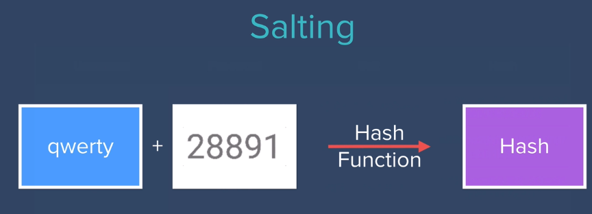

# Authentication & Security

> Check branches to get code for certian level

## Level 1 ( Register Users )

- simply let user register with username and password.
- stored username and password in database without any encryption ( vulnerable ).

## level 2 ( Data Encryption )

> Why Encryption❓ Any one who can access the database can get user passwords directly. 🙂🥲


- Save encrypted password in database instead saving them as it is.
- mongoose-encryption package is used for encryption [docs](https://www.npmjs.com/package/mongoose-encryption).
- simply plugged in the package [docs](https://mongoosejs.com/docs/plugins.html).

> mongoose plugins: By adding plugins to mongoose Schema we can extend their functionality.

```js
require("dotenv").config();
const encrypt = require("mongoose-encryption");

const userSchema = mongoose.Schema({
  email: String,
  password: String,
});

// keep the secret in the .env file
const secret = process.env.SECRET;

// plugin the mongoose-encryption package in Schema
userSchema.plugin(encrypt, { secret: secret, encryptedFields: ["password"] });

//plugin package before creating collection or model
const User = new mongoose.model("User", userSchema);
```

## level 3 ( Hashing Passwords )

> Why Hashing❓
> \
> Encrypted data is secure, but can be decrypted, anyone with key and cipher method can get actual data or password.

Hashing comes in the picture

> hash functions are complicated MATH FUNCTIONS which can hash any input in miliseconds, but It is almost impossible to undo hashing or get back plain text...


- Using hash function Hash the user password and store it in database, user is the only perosn who knows the actual password.
- Use same hash function to authenticate user.
- MD5 hash function. Widely used hash function, produce a 128-bit hash value [docs](https://www.npmjs.com/package/md5).

```js
var md5 = require('md5');

// save hashed password in database, while registration
password: md5(req.body.password),

// Use same hash function for authentication, while login
const password = md5(req.body.password);
```

## level 4 ( Salting & Hashing with bcrypt )

> Why not just Hashing❓

1. If password is not strong then there are multiple ways it can get hacked like Dictionary attack.
2. People have created Hash tables for commonly used passwords.
3. If multiple users have same password then their hashed values are also be same.

> Salting❓ A salt is a random string that makes the hash unpredictable.
> \
> Before hasing add salt to user password & store hashed password and salt in database.

1. It is impossible to hack.
2. Very difficult to find these hash values in hash tables on internet.
3. Now even users with same password endup having different hash values.



> Salt Rounds❓God level secure

1. First Round : Generate hash password using User password and salt.
2. Further Rounds : Generate new hash password using previously generated hashed password and same salt.


> bcrypt❓ Bcrypt is a popular and trusted method for salt and hashing passwords.

- bcrypt package from npm is all we need [docs](https://www.npmjs.com/package/bcrypt).
- There are two different techniques in documentation

1. Technique 1 (generate a salt and hash on separate function calls).
2. Technique 2 (auto-gen a salt and hash). used below.

```js
const bcrypt = require("bcrypt");
const saltRounds = 10;

// While registration use hash method
bcrypt.hash(req.body.password, saltRounds, function (err, hash) {
  // Store hash in your password DB.

  const password = hash; // Generated by bcrypt, js
});

// While authenticate or login use compare method
bcrypt.compare(req.body.password, password_from_db, function (err, result) {
  // result == true || false
});
```
